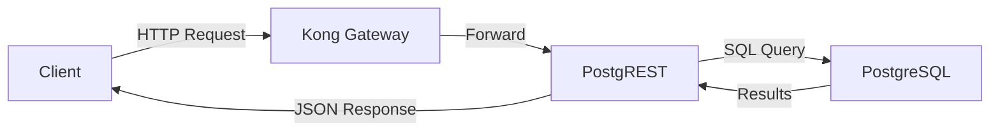
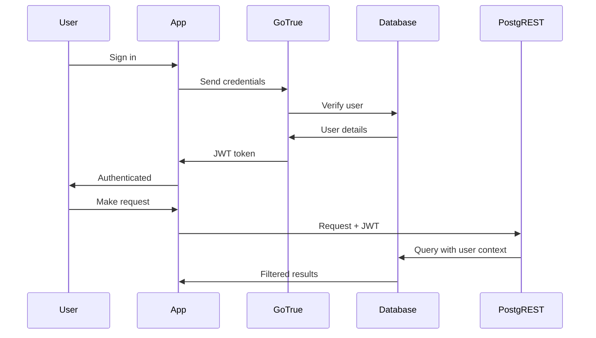

## Overview

Supabase is a unified platform built from multiple open-source components that work together seamlessly. Each component is independently powerful, but when combined, they provide a complete backend solution.


<Note>
This architecture applies to both the hosted platform and self-hosted deployments. The core components remain the same.
</Note>

## Core Components

### PostgreSQL Database

At the heart of Supabase is [PostgreSQL](https://www.postgresql.org/) - the world's most advanced open-source relational database.

<CardGroup cols={2}>
  <Card title="Features" icon="star">
    - ACID compliance for data integrity
    - Advanced data types (JSON, arrays, ranges)
    - Full-text search
    - Geospatial queries with PostGIS
    - Powerful indexing and query optimization
  </Card>
  
  <Card title="Extensions" icon="puzzle-piece">
    - pgvector for AI/embeddings
    - pg_cron for scheduled jobs
    - PostGIS for location data
    - pg_stat_statements for query analysis
    - And 50+ more extensions
  </Card>
</CardGroup>

**Why PostgreSQL?**

PostgreSQL has over 30 years of active development and is trusted by organizations worldwide for:
- Reliability and data integrity
- Standards compliance
- Extensibility
- Active community and ecosystem
- Battle-tested performance at scale

**Example: Advanced Data Types**

```sql
-- JSON columns for flexible schemas
CREATE TABLE products (
  id BIGINT PRIMARY KEY,
  name TEXT,
  metadata JSONB,  -- Fast JSON queries
  tags TEXT[],     -- Array of tags
  price_range NUMRANGE  -- Price ranges
);

-- Query JSON fields directly
SELECT * FROM products 
WHERE metadata->>'category' = 'electronics'
  AND tags @> ARRAY['featured'];
```

### PostgREST

[PostgREST](http://postgrest.org/) automatically generates a RESTful API from your PostgreSQL database schema.

**How it works:**

1. PostgREST introspects your database schema
2. Creates REST endpoints for each table and view
3. Translates HTTP requests to SQL queries
4. Respects Row Level Security policies

**Request Flow:**



**Example: Automatic API Generation**

```sql
-- Create a table
CREATE TABLE articles (
  id BIGINT GENERATED ALWAYS AS IDENTITY PRIMARY KEY,
  title TEXT,
  content TEXT,
  published BOOLEAN DEFAULT false,
  created_at TIMESTAMPTZ DEFAULT NOW()
);
```

PostgREST automatically creates these endpoints:

<CodeGroup>
```bash GET /articles
# List all articles
curl 'https://your-project.supabase.co/rest/v1/articles' \
  -H "apikey: your-anon-key"
```

```bash GET /articles?id=eq.1
# Get specific article
curl 'https://your-project.supabase.co/rest/v1/articles?id=eq.1' \
  -H "apikey: your-anon-key"
```

```bash POST /articles
# Create article
curl -X POST 'https://your-project.supabase.co/rest/v1/articles' \
  -H "apikey: your-anon-key" \
  -H "Content-Type: application/json" \
  -d '{"title": "Hello World", "content": "My first post"}'
```

```bash PATCH /articles?id=eq.1
# Update article
curl -X PATCH 'https://your-project.supabase.co/rest/v1/articles?id=eq.1' \
  -H "apikey: your-anon-key" \
  -H "Content-Type: application/json" \
  -d '{"published": true}'
```

```bash DELETE /articles?id=eq.1
# Delete article
curl -X DELETE 'https://your-project.supabase.co/rest/v1/articles?id=eq.1' \
  -H "apikey: your-anon-key"
```
</CodeGroup>

**Advanced Queries:**

PostgREST supports complex queries through URL parameters:

```typescript
// Filter, sort, and paginate
const { data } = await supabase
  .from('articles')
  .select('id, title, author:profiles(name, avatar)')
  .eq('published', true)
  .ilike('title', '%supabase%')
  .order('created_at', { ascending: false })
  .range(0, 9)  // Pagination

// Translates to efficient SQL with joins
```

### GoTrue (Authentication)

[GoTrue](https://github.com/supabase/gotrue) is a JWT-based authentication server that manages users and issues access tokens.

**Authentication Flow:**



**Key Features:**

<Tabs>
  <Tab title="Multiple Auth Methods">
    - **Email/Password** - Traditional authentication
    - **Magic Links** - Passwordless email login
    - **Phone/SMS** - Mobile-first authentication  
    - **Social OAuth** - Google, GitHub, GitLab, Azure, Facebook, Twitter, Discord, and more
    - **SAML SSO** - Enterprise single sign-on (Enterprise plan)
  </Tab>
  
  <Tab title="Security Features">
    - **JWT tokens** - Secure, stateless authentication
    - **Refresh tokens** - Long-lived sessions with automatic renewal
    - **Email confirmation** - Verify email addresses
    - **Password recovery** - Secure reset flows
    - **Rate limiting** - Protection against brute force
    - **Multi-factor auth** - TOTP-based 2FA
  </Tab>
  
  <Tab title="User Management">
    - User metadata storage
    - Custom claims for authorization
    - Admin API for user management
    - Hooks for custom logic
    - Email templates customization
  </Tab>
</Tabs>

**JWT Structure:**

When a user signs in, they receive a JWT token:

```json
{
  "aud": "authenticated",
  "exp": 1234567890,
  "sub": "user-uuid-here",
  "email": "user@example.com",
  "role": "authenticated",
  "user_metadata": {
    "full_name": "John Doe"
  }
}
```

This token is sent with every request, allowing PostgreSQL RLS policies to enforce user-specific access control.

**Example: Row Level Security with Auth**

```sql
-- Only authenticated users can read profiles
CREATE POLICY "Profiles are viewable by authenticated users"
  ON profiles FOR SELECT
  TO authenticated
  USING (true);

-- Users can only update their own profile
CREATE POLICY "Users can update own profile"
  ON profiles FOR UPDATE
  TO authenticated
  USING (auth.uid() = id)
  WITH CHECK (auth.uid() = id);

-- Custom role-based access
CREATE POLICY "Admins can delete any profile"
  ON profiles FOR DELETE
  TO authenticated
  USING (
    auth.jwt() ->> 'role' = 'admin'
  );
```

### Realtime

[Realtime](https://github.com/supabase/realtime) is an Elixir server that broadcasts database changes and enables presence and broadcast features.

**Three Modes of Operation:**

<Tabs>
  <Tab title="Database Changes">
    Listen to INSERT, UPDATE, and DELETE operations:
    
    ```typescript
    // Subscribe to all changes on a table
    const channel = supabase
      .channel('messages')
      .on(
        'postgres_changes',
        {
          event: '*',
          schema: 'public',
          table: 'messages'
        },
        (payload) => {
          console.log('Change received!', payload)
        }
      )
      .subscribe()
    ```
    
    **How it works:**
    1. PostgreSQL publishes WAL (Write-Ahead Log) changes
    2. Realtime server listens to the replication slot
    3. Filters changes based on RLS policies
    4. Broadcasts to subscribed clients via WebSockets
    
    <Warning>
    Realtime respects Row Level Security! Users only receive updates for rows they have access to.
    </Warning>
  </Tab>
  
  <Tab title="Presence">
    Track which users are online:
    
    ```typescript
    const channel = supabase.channel('room1')
    
    // Send presence data
    channel
      .on('presence', { event: 'sync' }, () => {
        const state = channel.presenceState()
        console.log('Online users:', state)
      })
      .subscribe(async (status) => {
        if (status === 'SUBSCRIBED') {
          await channel.track({
            user_id: userId,
            online_at: new Date().toISOString(),
          })
        }
      })
    ```
    
    **Use cases:**
    - Online user indicators
    - Collaborative editing cursors
    - "User is typing..." indicators
    - Active session tracking
  </Tab>
  
  <Tab title="Broadcast">
    Send messages between clients:
    
    ```typescript
    const channel = supabase.channel('game-room')
    
    // Listen for messages
    channel
      .on('broadcast', { event: 'move' }, (payload) => {
        console.log('Player moved:', payload)
      })
      .subscribe()
    
    // Send a message
    channel.send({
      type: 'broadcast',
      event: 'move',
      payload: { x: 100, y: 200 }
    })
    ```
    
    **Use cases:**
    - Multiplayer games
    - Chat applications
    - Collaborative whiteboards
    - Live cursors and selections
  </Tab>
</Tabs>

**Architecture:**

```
PostgreSQL WAL
  ↓
Realtime Server (Elixir)
  ↓
WebSocket Connections
  ↓
Client Applications
```

### Storage

[Storage](https://github.com/supabase/storage-api) provides S3-compatible object storage with PostgreSQL-based permissions.

**Features:**

<CardGroup cols={2}>
  <Card title="Storage Capabilities" icon="upload">
    - Large file uploads (up to 5GB per file)
    - Resumable uploads
    - Automatic image optimization
    - CDN distribution
    - Signed URLs for private files
  </Card>
  
  <Card title="Security" icon="shield">
    - Row Level Security for file access
    - Bucket-level policies
    - File size and type restrictions
    - Virus scanning (Enterprise)
  </Card>
</CardGroup>

**Example: Image Upload with RLS**

```typescript
// Create a storage bucket
const { data, error } = await supabase
  .storage
  .createBucket('avatars', {
    public: false,
    fileSizeLimit: 1024 * 1024 * 2 // 2MB
  })

// Upload a file
const file = event.target.files[0]
const { data, error } = await supabase
  .storage
  .from('avatars')
  .upload(`${userId}/${file.name}`, file)

// Get public URL (for public buckets)
const { data } = supabase
  .storage
  .from('avatars')
  .getPublicUrl(`${userId}/${file.name}`)

// Get signed URL (for private buckets)
const { data, error } = await supabase
  .storage
  .from('avatars')
  .createSignedUrl(`${userId}/${file.name}`, 60) // 60 seconds
```

**Storage Policies:**

```sql
-- Allow users to upload their own avatars
CREATE POLICY "Users can upload own avatar"
  ON storage.objects FOR INSERT
  TO authenticated
  WITH CHECK (
    bucket_id = 'avatars' AND
    (storage.foldername(name))[1] = auth.uid()::text
  );

-- Allow users to view all avatars
CREATE POLICY "Avatars are publicly accessible"
  ON storage.objects FOR SELECT
  TO public
  USING (bucket_id = 'avatars');

-- Allow users to delete their own avatars
CREATE POLICY "Users can delete own avatar"
  ON storage.objects FOR DELETE
  TO authenticated
  USING (
    bucket_id = 'avatars' AND
    (storage.foldername(name))[1] = auth.uid()::text
  );
```

**Image Transformation:**

Automatic image optimization on-the-fly:

```typescript
// Resize and optimize
const url = supabase
  .storage
  .from('avatars')
  .getPublicUrl('user.jpg', {
    transform: {
      width: 200,
      height: 200,
      resize: 'cover',
      quality: 80
    }
  })
```

### Edge Functions

[Edge Functions](https://github.com/supabase/edge-runtime) are server-side TypeScript functions that run on Deno at the edge, close to your users.

**Key Characteristics:**

- **TypeScript/JavaScript** - Familiar language and syntax
- **Deno runtime** - Secure by default, modern APIs
- **Global distribution** - Deploy to regions worldwide
- **Fast cold starts** - Minimal latency
- **HTTP triggers** - Invoke via HTTP requests
- **Cron triggers** - Schedule periodic execution

**Example: Send Welcome Email**

```typescript
// supabase/functions/send-welcome-email/index.ts
import { serve } from 'https://deno.land/std@0.168.0/http/server.ts'
import { createClient } from 'https://esm.sh/@supabase/supabase-js@2'

const RESEND_API_KEY = Deno.env.get('RESEND_API_KEY')

serve(async (req) => {
  try {
    // Get user from auth header
    const authHeader = req.headers.get('Authorization')!
    const supabase = createClient(
      Deno.env.get('SUPABASE_URL') ?? '',
      Deno.env.get('SUPABASE_ANON_KEY') ?? '',
      { global: { headers: { Authorization: authHeader } } }
    )
    
    const { data: { user } } = await supabase.auth.getUser()
    
    // Send email via Resend
    const res = await fetch('https://api.resend.com/emails', {
      method: 'POST',
      headers: {
        'Content-Type': 'application/json',
        'Authorization': `Bearer ${RESEND_API_KEY}`
      },
      body: JSON.stringify({
        from: 'noreply@yourapp.com',
        to: user.email,
        subject: 'Welcome to Our App!',
        html: `<h1>Welcome ${user.email}!</h1>`
      })
    })
    
    const data = await res.json()
    
    return new Response(
      JSON.stringify(data),
      { headers: { 'Content-Type': 'application/json' } }
    )
  } catch (error) {
    return new Response(
      JSON.stringify({ error: error.message }),
      { status: 500, headers: { 'Content-Type': 'application/json' } }
    )
  }
})
```

**Deploy and invoke:**

```bash
# Deploy
supabase functions deploy send-welcome-email

# Invoke from client
const { data, error } = await supabase.functions.invoke('send-welcome-email')
```

**Use Cases:**

- Send emails or notifications
- Process payments with Stripe
- Generate PDFs or images
- Call third-party APIs
- Complex validation logic
- Data aggregation and reporting
- Webhooks from external services

### pg_graphql

[pg_graphql](http://github.com/supabase/pg_graphql/) is a PostgreSQL extension that exposes a GraphQL API.

**Example: GraphQL Queries**

```typescript
// Query with the JavaScript client
const { data, error } = await supabase
  .graphql
  .query(`
    query GetPosts {
      postsCollection {
        edges {
          node {
            id
            title
            author {
              name
            }
            comments {
              edges {
                node {
                  content
                }
              }
            }
          }
        }
      }
    }
  `)
```

GraphQL is automatically generated from your database schema and respects Row Level Security.

### Kong API Gateway

[Kong](https://github.com/Kong/kong) sits in front of all services, providing:

- **Request routing** - Direct requests to appropriate services
- **Rate limiting** - Protect against abuse
- **API key validation** - Verify authentication
- **CORS handling** - Cross-origin request management
- **Request/response transformation** - Modify requests as needed

**Request Flow:**

```
Client Request
  ↓
Kong Gateway
  ├→ /rest/v1/*      → PostgREST
  ├→ /auth/v1/*      → GoTrue
  ├→ /storage/v1/*   → Storage API
  ├→ /realtime/v1/*  → Realtime Server
  └→ /functions/v1/* → Edge Functions
```

### postgres-meta

[postgres-meta](https://github.com/supabase/postgres-meta) provides a RESTful API for managing PostgreSQL:

- Fetch tables, columns, and relationships
- Create and modify schemas
- Manage roles and permissions
- Run queries
- View database statistics

This powers the Supabase Studio interface.

### Studio Dashboard

Supabase Studio is the web-based dashboard that provides:

<CardGroup cols={2}>
  <Card title="Table Editor" icon="table">
    Visual interface to browse and edit data, manage relationships, and view table schemas
  </Card>
  
  <Card title="SQL Editor" icon="code">
    Write and execute SQL queries with autocomplete and saved snippets
  </Card>
  
  <Card title="Auth Management" icon="users">
    Manage users, configure providers, and customize email templates
  </Card>
  
  <Card title="Storage Browser" icon="folder-open">
    Browse buckets, upload files, and manage storage policies
  </Card>
  
  <Card title="API Documentation" icon="book">
    Auto-generated API documentation based on your schema
  </Card>
  
  <Card title="Database Monitoring" icon="chart-line">
    View query performance, connection pools, and resource usage
  </Card>
</CardGroup>

## Request Lifecycle

Let's trace a typical request through the Supabase stack:

<Steps>
  <Step title="Client makes request">
    User application sends a request to query todos:
    
    ```typescript
    const { data } = await supabase
      .from('todos')
      .select('*')
      .eq('user_id', userId)
    ```
  </Step>
  
  <Step title="Kong receives request">
    Kong validates the API key and routes to PostgREST at `/rest/v1/todos`
  </Step>
  
  <Step title="PostgREST processes">
    - Parses the request into SQL
    - Extracts JWT from headers
    - Sets PostgreSQL session variables (`request.jwt.claims`)
  </Step>
  
  <Step title="PostgreSQL executes query">
    - Runs the SQL query
    - Evaluates Row Level Security policies using JWT claims
    - Returns only rows the user has access to
    
    ```sql
    SELECT * FROM todos
    WHERE user_id = $1
      AND ( -- RLS policy check
        auth.uid() = user_id
      )
    ```
  </Step>
  
  <Step title="Response returned">
    - PostgreSQL returns filtered results
    - PostgREST formats as JSON
    - Kong sends response to client
    - Total round trip: ~50-100ms
  </Step>
</Steps>

## Deployment Architecture

### Hosted Platform

When using supabase.com:

```
Global CDN (Cloudflare)
  ↓
Load Balancer
  ↓
┌─────────────────────────┐
│   Your Project          │
│  ┌──────────────────┐   │
│  │ Kong Gateway     │   │
│  └────────┬─────────┘   │
│           │              │
│  ┌────────┴─────────┐   │
│  │ Service Layer    │   │
│  │ • PostgREST      │   │
│  │ • GoTrue         │   │
│  │ • Realtime       │   │
│  │ • Storage        │   │
│  │ • Functions      │   │
│  └────────┬─────────┘   │
│           │              │
│  ┌────────┴─────────┐   │
│  │ PostgreSQL       │   │
│  │ (Dedicated)      │   │
│  └──────────────────┘   │
└─────────────────────────┘
```

**Benefits:**
- Automatic scaling
- Global distribution
- Managed backups
- Monitoring and alerting
- No operational overhead

### Self-Hosted

Using Docker Compose:

```yaml
services:
  kong:
    image: kong:latest
    ports:
      - "8000:8000"
  
  postgres:
    image: supabase/postgres:latest
    volumes:
      - postgres-data:/var/lib/postgresql/data
  
  auth:
    image: supabase/gotrue:latest
  
  rest:
    image: postgrest/postgrest:latest
  
  realtime:
    image: supabase/realtime:latest
  
  storage:
    image: supabase/storage-api:latest
  
  studio:
    image: supabase/studio:latest
    ports:
      - "3000:3000"
```

**Benefits:**
- Full control
- Deploy anywhere
- No vendor lock-in
- Custom configurations

## Security Architecture

### Multi-Layer Security

<Tabs>
  <Tab title="Network Layer">
    - **TLS/SSL** - All traffic encrypted in transit
    - **DDoS protection** - Cloudflare protection on hosted platform
    - **Network isolation** - Services in private networks
  </Tab>
  
  <Tab title="API Layer">
    - **API keys** - Required for all requests
    - **JWT validation** - Signed tokens verified
    - **Rate limiting** - Protection against abuse
    - **CORS policies** - Restrict allowed origins
  </Tab>
  
  <Tab title="Database Layer">
    - **Row Level Security** - Fine-grained access control
    - **SSL connections** - Encrypted database connections
    - **Database roles** - Principle of least privilege
    - **Audit logging** - Track all database operations
  </Tab>
  
  <Tab title="Application Layer">
    - **Email verification** - Confirm user identities
    - **Password policies** - Enforce strong passwords
    - **MFA support** - Two-factor authentication
    - **Session management** - Automatic token refresh
  </Tab>
</Tabs>

### API Keys

Supabase provides two main keys:

<Tabs>
  <Tab title="anon (public) key">
    - Safe to use in browsers and mobile apps
    - Has limited permissions
    - Used with user JWT for authenticated requests
    - RLS policies protect data
    
    ```typescript
    const supabase = createClient(url, ANON_KEY)
    ```
  </Tab>
  
  <Tab title="service_role key">
    - **Never** expose in client code
    - Bypasses Row Level Security
    - Use only in secure server environments
    - Full database access
    
    ```typescript
    // Server-side only!
    const supabase = createClient(url, SERVICE_ROLE_KEY)
    ```
  </Tab>
</Tabs>

<Warning>
**Critical:** Never commit service_role keys to version control or use them in client applications. This key has unrestricted access to your database.
</Warning>

## Scalability

Supabase components are designed to scale:

### Horizontal Scaling

- **PostgREST** - Stateless, can run multiple instances
- **GoTrue** - Scales horizontally with load balancing
- **Realtime** - Distributed across multiple nodes
- **Storage** - S3-compatible, infinitely scalable
- **Edge Functions** - Automatically scaled and distributed

### Database Scaling

<Tabs>
  <Tab title="Vertical Scaling">
    Increase compute resources:
    - More CPU cores
    - More RAM
    - Faster storage (NVMe SSDs)
    
    Hosted platform supports up to:
    - 64 CPU cores
    - 256 GB RAM
    - Dedicated resources
  </Tab>
  
  <Tab title="Read Replicas">
    Distribute read load:
    - Create read-only replicas
    - Route read queries to replicas
    - Keep write queries on primary
    - Automatic failover
  </Tab>
  
  <Tab title="Connection Pooling">
    Efficient connection management:
    - PgBouncer for connection pooling
    - Supavisor for advanced pooling
    - Handle thousands of connections
    - Minimal overhead
  </Tab>
</Tabs>

## Monitoring and Observability

### Built-in Monitoring

Supabase provides comprehensive monitoring:

- **Query Performance** - Slow query logs and analysis
- **Resource Usage** - CPU, memory, disk, and network
- **API Analytics** - Request rates, response times, errors
- **Realtime Connections** - Active connections and channels
- **Storage Metrics** - Bandwidth and storage usage

### Logging

Collect logs from all components:

- **PostgreSQL logs** - Query logs, error logs
- **API logs** - Request/response logs
- **Edge Function logs** - Console output and errors
- **Auth logs** - Sign-in attempts and failures

Hosted platform integrates with:
- Logflare for log management
- Webhook destinations
- Custom integrations

## Next Steps

Now that you understand Supabase architecture:

<CardGroup cols={2}>
  <Card title="Database Guide" icon="database" href="https://supabase.com/docs/guides/database">
    Deep dive into PostgreSQL features and best practices
  </Card>
  
  <Card title="Auth Guide" icon="shield" href="https://supabase.com/docs/guides/auth">
    Learn advanced authentication patterns
  </Card>
  
  <Card title="Realtime Guide" icon="bolt" href="https://supabase.com/docs/guides/realtime">
    Build real-time collaborative features
  </Card>
  
  <Card title="Self-Hosting" icon="server" href="https://supabase.com/docs/guides/hosting/overview">
    Deploy Supabase on your infrastructure
  </Card>
</CardGroup>
