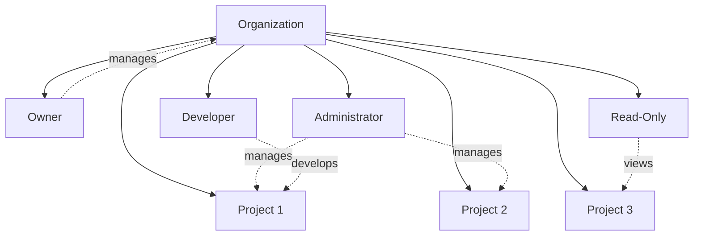

Organizations in Supabase allow you to group projects, manage team members, and consolidate billing. An organization can contain multiple projects and team members with different permission levels.

## Creating an Organization

When you sign up for Supabase, a personal organization is automatically created. You can create additional organizations for teams or different business units.

<Steps>
  <Step title="Navigate to Organizations">
    Click your profile icon in the dashboard and select "New Organization".
  </Step>
  
  <Step title="Organization Details">
    Enter:
    - **Organization Name**: Your company or team name
    - **Billing Email**: Where invoices will be sent
    - **Plan**: Free, Pro, Team, or Enterprise
  </Step>
  
  <Step title="Add Team Members">
    Invite team members by email with appropriate roles.
  </Step>
</Steps>

## Organization Structure



## Team Roles & Permissions

Supabase organizations support role-based access control:

### Owner

Full administrative access:

- Create and delete projects
- Manage billing and subscriptions
- Invite and remove team members
- Change organization settings
- Access all projects
- Delete organization

<Warning>
  Organizations must have at least one Owner. Transfer ownership before removing the last owner.
</Warning>

### Administrator

Project and team management:

- Create and delete projects
- Invite team members (cannot remove Owners)
- Configure project settings
- Access API keys and database credentials
- View billing information
- Cannot manage billing or delete organization

### Developer

Project development access:

- Access assigned projects
- View and edit database schema
- Deploy edge functions
- Manage storage buckets
- View logs and metrics
- Cannot create projects or invite members
- Cannot access billing information

### Read-Only

View-only access:

- View database schema (cannot edit)
- View project settings
- View logs and metrics
- Cannot make any changes
- Cannot access API keys or credentials

<Info>
  Custom roles with granular permissions are available on Enterprise plans.
</Info>

## Managing Team Members

### Inviting Members

<Steps>
  <Step title="Send Invitation">
    Navigate to Organization Settings → Team and click "Invite member".
  </Step>
  
  <Step title="Set Permissions">
    Enter email address and select role (Owner, Administrator, Developer, or Read-Only).
  </Step>
  
  <Step title="Project Access">
    For Developers and Read-Only users, select which projects they can access.
  </Step>
</Steps>

Invited members receive an email with a link to accept the invitation.

### Managing Existing Members

**Change Role**:
- Navigate to Team settings
- Click the member's role dropdown
- Select new role

**Update Project Access**:
- Click member's project access settings
- Add or remove project permissions

**Remove Member**:
- Click the remove icon next to member
- Confirm removal
- Member loses access immediately

### Single Sign-On (SSO)

Enterprise organizations can enable SAML-based SSO:

- Okta
- Azure AD
- Google Workspace
- OneLogin
- Auth0
- Custom SAML 2.0 providers

<CodeGroup>
```xml SAML Configuration Example
<EntityDescriptor>
  <SPSSODescriptor>
    <AssertionConsumerService
      Binding="urn:oasis:names:tc:SAML:2.0:bindings:HTTP-POST"
      Location="https://api.supabase.com/auth/v1/sso/saml/acs"
      index="0" />
  </SPSSODescriptor>
</EntityDescriptor>
```
</CodeGroup>

## Organization Settings

### General Settings

**Organization Name**: Update display name for your organization

**Slug**: URL-friendly identifier (e.g., `my-company` → `supabase.com/dashboard/org/my-company`)

**Billing Email**: Primary contact for invoices and billing notifications

**Tax ID**: Add VAT, GST, or other tax identification numbers

### Security Settings

**Two-Factor Authentication (2FA)**:
- Require 2FA for all organization members
- Supports TOTP authenticator apps
- SMS backup codes

**IP Allowlisting** (Enterprise):
- Restrict dashboard access to specific IP ranges
- Require VPN for remote team members

**Audit Logs** (Enterprise):
- Track all organization and project changes
- Monitor member activity
- Compliance and security reviews

### Integrations

Connect external services to your organization:

**GitHub**: 
- Deploy edge functions from repositories
- Automatic deployments on push
- Preview deployments for pull requests

**Vercel**:
- Auto-configure environment variables
- Preview environments for each branch

**Slack**:
- Project alerts and notifications
- Deployment updates
- Error monitoring

## Billing & Plans

Billing is managed at the organization level:

### Plan Comparison

<Tabs>
  <Tab title="Free">
    Perfect for hobby projects and learning:
    
    - 2 projects included
    - 500 MB database
    - 1 GB file storage
    - 2 GB bandwidth
    - Community support
    - Projects pause after 7 days inactivity
  </Tab>
  
  <Tab title="Pro">
    For production applications:
    
    - Unlimited projects (pay per project)
    - 8 GB database per project
    - 100 GB storage per project
    - 50 GB bandwidth per project
    - Email support
    - Daily backups
    - No project pausing
    - Custom domains
  </Tab>
  
  <Tab title="Team">
    For growing teams:
    
    - Everything in Pro
    - 100 GB database per project
    - 250 GB bandwidth per project
    - Priority email support
    - 1 hour support SLA
    - Read replicas
  </Tab>
  
  <Tab title="Enterprise">
    For large-scale deployments:
    
    - Custom database size
    - Unlimited bandwidth
    - 24/7 support with SLA
    - SAML SSO
    - Custom contracts
    - Dedicated infrastructure
    - SOC 2 compliance
  </Tab>
</Tabs>

### Usage-Based Pricing

Beyond included limits, pay for:

- **Compute**: Additional database CPU and memory
- **Storage**: Database and file storage
- **Bandwidth**: API requests and file transfers
- **Edge Functions**: Invocations and compute time
- **Realtime**: Concurrent connections and messages

### Managing Billing

**Payment Methods**:
- Credit/debit cards (Visa, Mastercard, Amex)
- ACH transfers (Enterprise)
- Wire transfers (Enterprise)

**Invoices**:
- Automatically generated monthly
- Downloadable from dashboard
- Sent to billing email
- Include detailed usage breakdown

**Spending Limits**:
- Set maximum monthly spend
- Receive alerts at 50%, 75%, and 90%
- Prevent unexpected charges

## Transferring Projects

Move projects between organizations:

<Steps>
  <Step title="Navigate to Project Settings">
    Open the project you want to transfer.
  </Step>
  
  <Step title="Transfer Project">
    Go to Settings → General → Transfer Project.
  </Step>
  
  <Step title="Select Destination">
    Choose the target organization (must be Owner of both).
  </Step>
  
  <Step title="Confirm Transfer">
    Type project name to confirm. Transfer is immediate and cannot be undone.
  </Step>
</Steps>

<Warning>
  Transferring a project moves all billing to the new organization from the next billing cycle.
</Warning>

## Best Practices

<AccordionGroup>
  <Accordion title="Separate Organizations" icon="building">
    Create separate organizations for different companies or business units to isolate billing and access.
  </Accordion>

  <Accordion title="Principle of Least Privilege" icon="lock">
    Grant team members the minimum permissions needed. Use Developer role for most team members.
  </Accordion>

  <Accordion title="Regular Access Reviews" icon="clipboard-check">
    Quarterly review of team member access. Remove members who have left or changed roles.
  </Accordion>

  <Accordion title="Enable 2FA" icon="shield-halved">
    Require two-factor authentication for all organization members, especially Owners and Administrators.
  </Accordion>

  <Accordion title="Monitor Usage" icon="chart-mixed">
    Set spending limits and enable billing alerts to avoid unexpected charges.
  </Accordion>
</AccordionGroup>

## Next Steps

<CardGroup cols={2}>
  <Card title="Projects" icon="folder-tree" href="/platform/projects">
    Learn about managing projects
  </Card>
  <Card title="Billing" icon="credit-card" href="/platform/billing">
    Understand pricing and usage
  </Card>
  <Card title="Security" icon="shield" href="/self-hosting/security">
    Security best practices
  </Card>
  <Card title="Support" icon="life-ring" href="https://supabase.com/support">
    Get help from our team
  </Card>
</CardGroup>