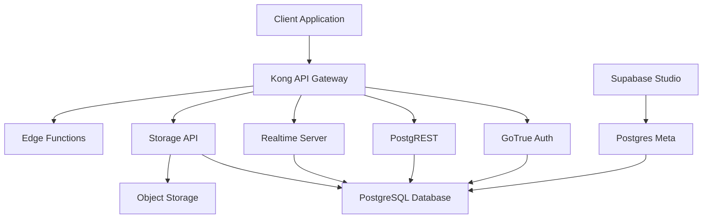

Supabase is an open source Firebase alternative that provides all the backend services you need to build a product. The platform combines enterprise-grade open source tools to give developers a complete backend-as-a-service solution.

## What is Supabase?

Supabase is the Postgres development platform. We're building the features of Firebase using enterprise-grade open source tools. If the tools and communities exist, with an MIT, Apache 2, or equivalent open license, we will use and support that tool.

<CardGroup cols={2}>
  <Card title="Hosted Postgres Database" icon="database">
    Production-ready Postgres database with automatic backups and point-in-time recovery
  </Card>
  <Card title="Authentication" icon="shield">
    Complete user management with support for email, OAuth providers, and magic links
  </Card>
  <Card title="Auto-generated APIs" icon="code">
    Instant REST and GraphQL APIs that automatically reflect your database schema
  </Card>
  <Card title="Realtime Subscriptions" icon="bolt">
    Listen to database changes in real-time using websockets
  </Card>
  <Card title="Storage" icon="folder">
    Store and serve large files with built-in image transformations
  </Card>
  <Card title="Edge Functions" icon="function">
    Deploy serverless TypeScript functions close to your users
  </Card>
</CardGroup>

## Platform Architecture

Supabase combines several open source tools into a unified platform:

### Core Components

<AccordionGroup>
  <Accordion title="PostgreSQL" icon="database">
    Object-relational database system with over 30 years of active development. Supabase runs Postgres with useful extensions like `pgvector` for AI/ML workloads, `pg_cron` for scheduled jobs, and `PostGIS` for geospatial data.
  </Accordion>

  <Accordion title="Kong" icon="server">
    Cloud-native API gateway that handles routing, authentication, and rate limiting for all Supabase services.
  </Accordion>

  <Accordion title="GoTrue" icon="key">
    JWT-based authentication service that handles user sign-ups, logins, password resets, and OAuth integrations.
  </Accordion>

  <Accordion title="PostgREST" icon="brackets-curly">
    Web server that automatically generates a RESTful API from your PostgreSQL database schema. No backend code required.
  </Accordion>

  <Accordion title="Realtime" icon="signal-stream">
    Elixir server that listens to PostgreSQL replication logs and broadcasts database changes over websockets to subscribed clients.
  </Accordion>

  <Accordion title="Storage API" icon="cloud-arrow-up">
    RESTful interface for managing files in S3-compatible storage, with Postgres handling permissions and access control.
  </Accordion>

  <Accordion title="Edge Runtime" icon="globe">
    Deno-based runtime for deploying serverless TypeScript, JavaScript, and WASM functions at the edge.
  </Accordion>

  <Accordion title="Supabase Studio" icon="gauge">
    Web-based dashboard for managing your database, viewing logs, running SQL queries, and configuring authentication providers.
  </Accordion>
</AccordionGroup>

## Platform Features

### Database

- Full Postgres power with extensions
- Automatic migrations tracking
- Point-in-time recovery
- Database backups
- Connection pooling via Supavisor

### Authentication

- Email & password authentication
- Magic link (passwordless) login
- OAuth providers (Google, GitHub, Azure, etc.)
- Phone authentication with SMS
- Multi-factor authentication (MFA)
- Row Level Security policies

### Auto-generated APIs

- RESTful API via PostgREST
- GraphQL API via pg_graphql
- Real-time subscriptions
- Automatic OpenAPI documentation

### Storage

- S3-compatible object storage
- Image transformations via imgproxy
- Resumable uploads
- Access control via RLS
- CDN integration

### Edge Functions

- Deploy TypeScript/JavaScript functions
- Run Deno runtime at the edge
- Access to npm packages
- Database and storage access
- Scheduled function execution

### Observability

- Real-time logs via Logflare
- Performance monitoring
- Query analytics
- Error tracking
- Custom log drains

## Deployment Options

<CardGroup cols={2}>
  <Card title="Supabase Cloud" icon="cloud" href="https://supabase.com/dashboard">
    Fully managed platform with automatic updates, backups, and scaling
  </Card>
  <Card title="Self-Hosted" icon="server" href="/self-hosting/overview">
    Deploy on your own infrastructure using Docker Compose
  </Card>
</CardGroup>

## Getting Started

<Steps>
  <Step title="Create a Project">
    Sign up for Supabase and create your first project. Choose your database region and set a strong database password.
  </Step>
  
  <Step title="Design Your Schema">
    Use the Table Editor or SQL Editor to create your database tables and relationships.
  </Step>
  
  <Step title="Enable Authentication">
    Configure authentication providers and set up Row Level Security policies to protect your data.
  </Step>
  
  <Step title="Connect Your App">
    Install the Supabase client library and connect your frontend application.
  </Step>
</Steps>

## Client Libraries

Supabase provides official client libraries for popular platforms:

- **JavaScript/TypeScript** - [supabase-js](https://github.com/supabase/supabase-js)
- **Flutter** - [supabase-flutter](https://github.com/supabase/supabase-flutter)
- **Swift** - [supabase-swift](https://github.com/supabase/supabase-swift)
- **Python** - [supabase-py](https://github.com/supabase/supabase-py)

Community libraries are available for C#, Go, Java, Kotlin, Ruby, and more.

## Next Steps

<CardGroup cols={2}>
  <Card title="Projects" icon="folder-tree" href="/platform/projects">
    Learn about project management and configuration
  </Card>
  <Card title="Organizations" icon="users" href="/platform/organizations">
    Manage teams and access control
  </Card>
  <Card title="Billing" icon="credit-card" href="/platform/billing">
    Understand pricing and usage
  </Card>
  <Card title="Quickstart" icon="rocket" href="/quickstart">
    Build your first app with Supabase
  </Card>
</CardGroup>