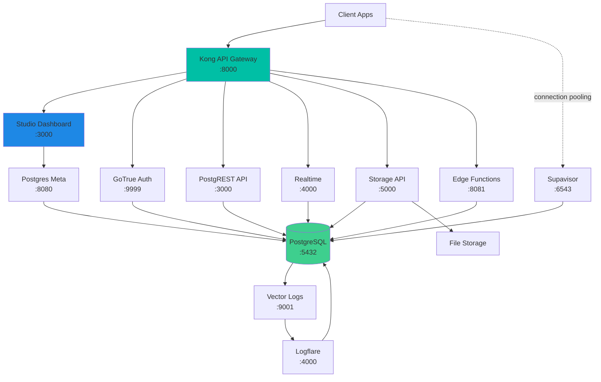

Self-hosting Supabase gives you complete control over your data and infrastructure. Deploy the entire Supabase stack on your own servers, cloud provider, or on-premise datacenter.

## Why Self-Host?

<CardGroup cols={2}>
  <Card title="Data Sovereignty" icon="shield">
    Keep all data within your infrastructure and jurisdiction. Meet strict compliance requirements.
  </Card>
  <Card title="Cost Control" icon="dollar-sign">
    Optimize costs for high-scale applications by using your existing infrastructure.
  </Card>
  <Card title="Customization" icon="wrench">
    Modify and extend Supabase components to fit your specific needs.
  </Card>
  <Card title="Air-Gapped Deployment" icon="lock">
    Run completely offline for maximum security in restricted environments.
  </Card>
</CardGroup>

## What You Get

Self-hosted Supabase includes all core components:

- **Supabase Studio** - Web dashboard for database management
- **PostgreSQL** - Industry-leading relational database
- **PostgREST** - Automatic REST API from your database schema
- **GoTrue** - JWT-based authentication and user management
- **Realtime** - WebSocket server for database change notifications
- **Storage API** - S3-compatible file storage with image transformations
- **Kong** - API gateway for routing and security
- **Edge Runtime** - Run Deno-based serverless functions
- **Logflare** - Log aggregation and analytics
- **Supavisor** - Connection pooler for Postgres

## Architecture

## System Requirements

### Minimum Requirements

For development/testing:

- **CPU**: 2 cores
- **RAM**: 4 GB
- **Storage**: 20 GB SSD
- **OS**: Linux (Ubuntu 20.04+, Debian 11+, or RHEL 8+)
- **Software**: Docker 20.10+ and Docker Compose 2.10+

### Recommended for Production

For production workloads:

- **CPU**: 4+ cores (8+ for high traffic)
- **RAM**: 8 GB minimum (16 GB+ recommended)
- **Storage**: 100 GB SSD (scales with data)
- **Network**: 1 Gbps connection
- **Backup**: Separate volume for database backups

<Warning>
  The default configuration is NOT secure for production. You must change all default passwords and secrets before deploying.
</Warning>

## Deployment Options

### Docker Compose (Recommended)

The easiest way to self-host Supabase:

<Pros>
  - Quick setup with single command
  - All services pre-configured
  - Easy updates and rollbacks
  - Works on any Docker-compatible platform
</Pros>

<Cons>
  - Single-server deployment
  - Manual scaling required
  - No automatic failover
</Cons>

### Kubernetes

For production-grade deployments:

<Pros>
  - Automatic scaling and load balancing
  - High availability and failover
  - Rolling updates with zero downtime
  - Multi-region support
</Pros>

<Cons>
  - Complex setup and configuration
  - Requires Kubernetes expertise
  - Higher operational overhead
</Cons>

<Info>
  Official Kubernetes Helm charts are in development. For now, use Docker Compose for production or build custom K8s manifests.
</Info>

### Cloud Providers

Deploy on popular cloud platforms:

- **AWS**: EC2, ECS, or EKS
- **Google Cloud**: Compute Engine or GKE
- **Azure**: Virtual Machines or AKS
- **Digital Ocean**: Droplets or Kubernetes
- **Linode**: Compute instances
- **Hetzner**: Dedicated or cloud servers

### On-Premise

Deploy in your own datacenter:

- Physical servers
- VMware or Proxmox VMs
- Private cloud infrastructure
- Air-gapped environments

## Feature Comparison

Self-hosted vs. Supabase Cloud:

| Feature | Self-Hosted | Supabase Cloud |
|---------|-------------|----------------|
| **Database** | Full Postgres access | Full Postgres access |
| **Authentication** | ✅ All providers | ✅ All providers |
| **Storage** | ✅ S3-compatible | ✅ Managed S3 |
| **Realtime** | ✅ Full feature set | ✅ Full feature set |
| **Edge Functions** | ✅ Self-managed | ✅ Global deployment |
| **Studio Dashboard** | ✅ Included | ✅ Enhanced UI |
| **Automatic Backups** | ⚙️ Configure yourself | ✅ Automated daily |
| **Point-in-Time Recovery** | ⚙️ WAL archiving required | ✅ 7-day window |
| **Automatic Scaling** | ❌ Manual | ✅ Automatic |
| **DDoS Protection** | ⚙️ Configure yourself | ✅ Included |
| **CDN** | ⚙️ Configure yourself | ✅ Global CDN |
| **Monitoring** | ⚙️ Logflare included | ✅ Enhanced metrics |
| **Support** | 💬 Community | 📧 Email + Priority |
| **Updates** | ⚙️ Manual | ✅ Automatic |
| **Multi-Region** | ⚙️ Configure yourself | ✅ Simple setup |
| **SOC 2 Compliance** | ⚙️ Your responsibility | ✅ Certified |

## Getting Started

Choose your deployment method:

<CardGroup cols={2}>
  <Card title="Docker Compose" icon="docker" href="/self-hosting/docker">
    Quick start guide for Docker-based deployment
  </Card>
  <Card title="Configuration" icon="gear" href="/self-hosting/configuration">
    Environment variables and settings
  </Card>
  <Card title="Security" icon="shield-check" href="/self-hosting/security">
    Secure your self-hosted installation
  </Card>
  <Card title="Updates" icon="arrow-up-from-bracket" href="/self-hosting/updates">
    Keep your stack up-to-date
  </Card>
</CardGroup>

## Support & Community

<Info>
  Self-hosted Supabase is **community-supported**. Managed support is available on Enterprise plans.
</Info>

### Community Resources

**GitHub Discussions**:
- [Self-Hosting Questions](https://github.com/orgs/supabase/discussions?discussions_q=is%3Aopen+label%3Aself-hosted)
- [What's Working (and What's Not)](https://github.com/orgs/supabase/discussions/39820)

**GitHub Issues**:
- [Report Bugs](https://github.com/supabase/supabase/issues?q=is%3Aissue%20state%3Aopen%20label%3Aself-hosted)
- [Feature Requests](https://github.com/supabase/supabase/issues/new?labels=self-hosted)

**Discord**:
- Join [discord.supabase.com](https://discord.supabase.com)
- #self-hosting channel for questions
- Active community of self-hosters

**Reddit**:
- [r/Supabase](https://www.reddit.com/r/Supabase/) community
- Share experiences and solutions

### Enterprise Support

For production self-hosted deployments:

- **Dedicated support** channel
- **Architecture review** and recommendations
- **Custom SLAs** available
- **Migration assistance** from other platforms
- **Training** for your team

Contact [enterprise@supabase.com](mailto:enterprise@supabase.com) for details.

## Limitations & Considerations

<AccordionGroup>
  <Accordion title="Manual Updates Required" icon="wrench">
    You're responsible for applying updates and security patches. Monitor the [changelog](/self-hosting/updates) regularly.
  </Accordion>

  <Accordion title="No Automatic Scaling" icon="chart-line">
    Self-hosted deployments don't auto-scale. Plan capacity based on expected traffic and monitor resource usage.
  </Accordion>

  <Accordion title="Backup & Disaster Recovery" icon="hard-drive">
    Implement your own backup strategy, test restore procedures, and plan for disaster recovery scenarios.
  </Accordion>

  <Accordion title="Security Hardening" icon="shield">
    You're responsible for securing the infrastructure, applying patches, managing secrets, and configuring firewalls.
  </Accordion>

  <Accordion title="Operational Expertise" icon="user-gear">
    Requires knowledge of Docker, PostgreSQL, networking, and Linux system administration.
  </Accordion>
</AccordionGroup>

## Migration Paths

### From Supabase Cloud to Self-Hosted

<Steps>
  <Step title="Export Data">
    Use `pg_dump` to export your database schema and data.
  </Step>
  
  <Step title="Download Storage Files">
    Backup all files from Storage buckets.
  </Step>
  
  <Step title="Deploy Self-Hosted">
    Set up your self-hosted instance.
  </Step>
  
  <Step title="Import Data">
    Restore database and storage files.
  </Step>
  
  <Step title="Update Connection Strings">
    Point your applications to new self-hosted instance.
  </Step>
</Steps>

### From Self-Hosted to Supabase Cloud

Contact [migrations@supabase.com](mailto:migrations@supabase.com) for assisted migration to Supabase Cloud.

## Next Steps

<Steps>
  <Step title="Install with Docker">
    Follow the [Docker installation guide](/self-hosting/docker) to deploy Supabase in minutes.
  </Step>
  
  <Step title="Configure Services">
    Review [configuration options](/self-hosting/configuration) and customize for your environment.
  </Step>
  
  <Step title="Secure Your Installation">
    Follow [security best practices](/self-hosting/security) before going to production.
  </Step>
  
  <Step title="Set Up Updates">
    Create an [update strategy](/self-hosting/updates) to keep your stack current.
  </Step>
</Steps>